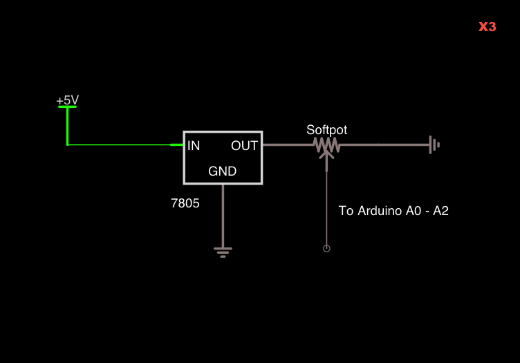
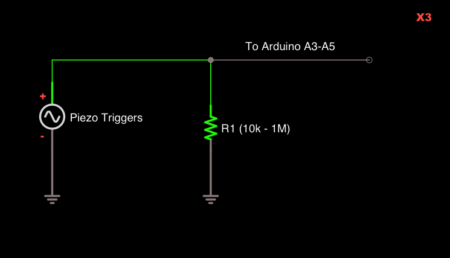
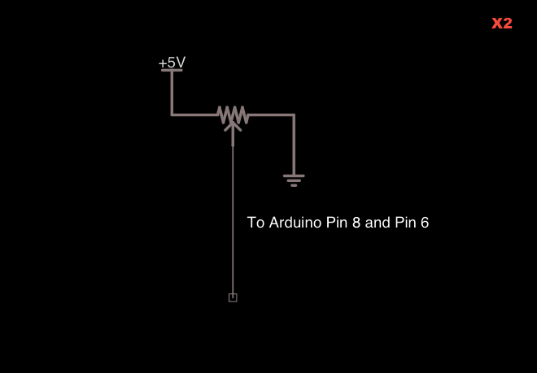
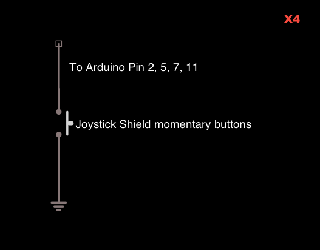
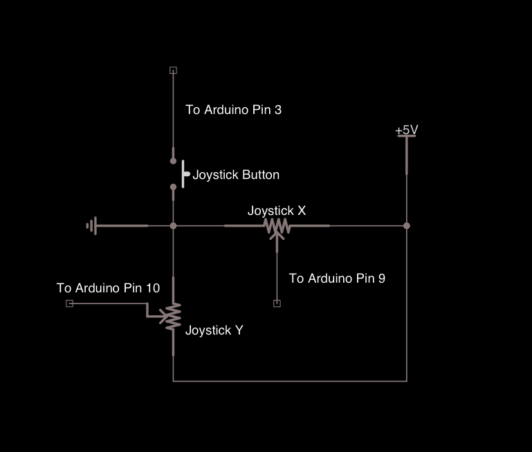
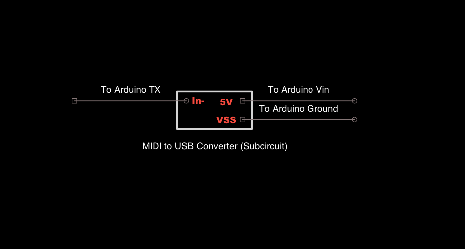

<h1>EDIT: this code is newer and much less bad. Please reference this instead: https://github.com/deanm1278/arduinoRibbonController
Note that it uses force sensitive resistors instead of piezo drum pads</h1>

# [Arduino Ribbon Synth](https://www.youtube.com/watch?v=s3dBox-LB7I)

# bcxvbcxvbcxvbxcbxcvbv

I decided to break the schematic down into its components so it would be easy for people to recreate. The Arduino really does all the heavy lifting and allows the rest of the circuit to be very simple. The red number in the top right hand corner of each picture is how many of each circuit are needed.

## The Softpot Strings

These are the strings of the synth (https://www.sparkfun.com/products/8681). Solder them up like this, each with it's own 7805 voltage regulator.

EDIT: this is actually stupid. All you really need is a 10k resistor in series between the middle softpot pin and the arduino adc input. Don't use a regulator for this.

## Piezo triggers

These were ripped from a Yamaha DD-55 drum machine. The positive of each goes to its respective pin on the Arduino, with a resistor to ground to protect the Arduino inputs. I used 82K on mine.

## Potentiometers

These are the regular potentiometers on the body of the synth you can use to control anything you like.

## Momentary Buttons

These are the momentary buttons on the Sparkfun joystick shield (https://www.sparkfun.com/products/9760). Pretty self explanatory, they just pull the digital input pins LOW when engaged.

## Joystick

This is the joystick on the the Joystick shield. Each direction is just a potentiometer and there is another momentary push button you engage by clicking the stick down.

# Connection to the MIDI -> USB converter

[Credit for this little hack goes to shiftmore](http://shiftmore.blogspot.com/2010/01/quick-and-dirty-arduino-midi-over-usb.html). [This is a cheap MIDI -> USB converter I bought on Amazon](http://www.amazon.com/gp/product/B001LJUVO4/ref=gno_cart_title_1?ie=UTF8&psc=1&smid=A3VI6G7CYYGB3B). Remove the MIDI cables, and solder the thing up as shown. No need for desoldering anything really, I just soldered on top of the already existing wires.

